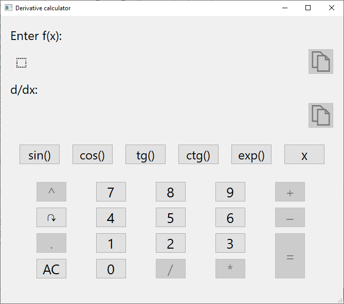
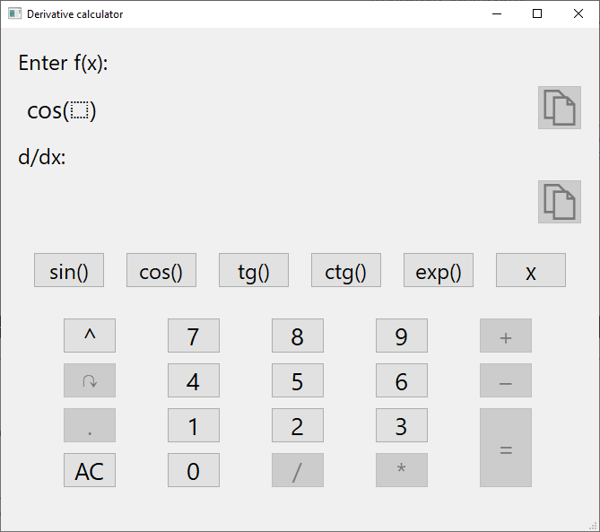
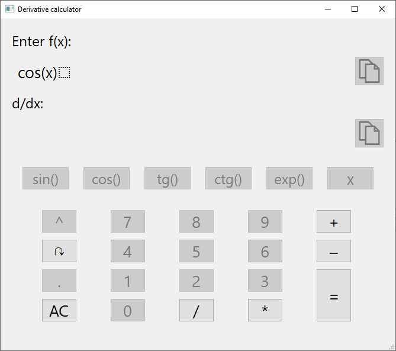
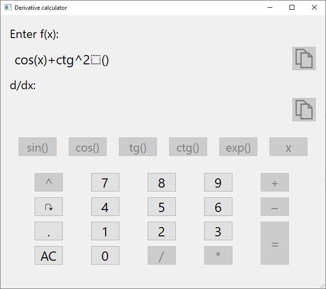
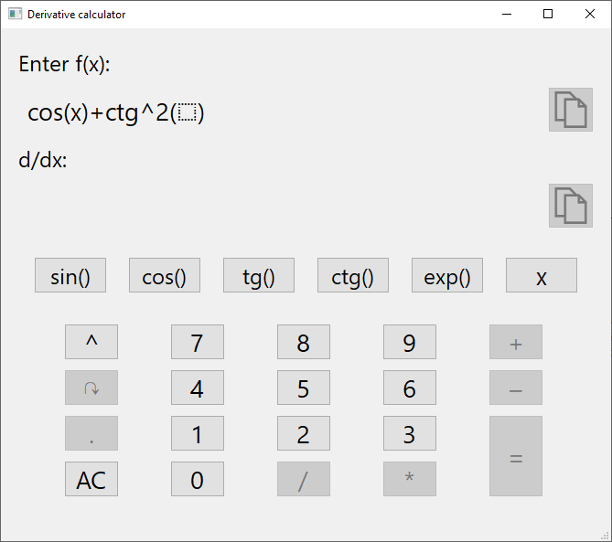
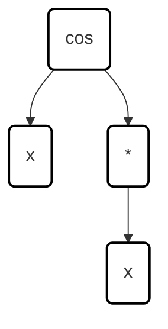
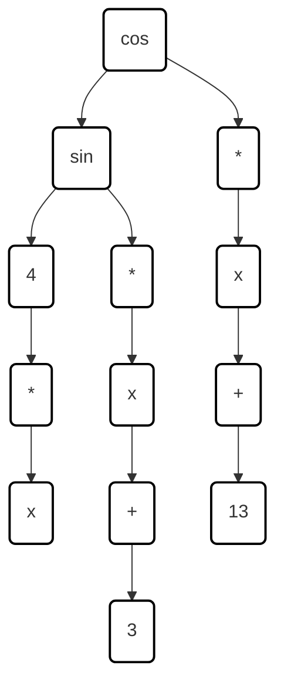

## How to use it
___

Now you can see the start of the program. For correcting input some buttons are blocked:

The Dotted square showes where are you now. After entering a function it will be inside it automatically:

If you want you can manage him by pressing the arrow button:

You can also enter a power of the function. To enter it you need to press power button. Pay attention that you must be inside of this func:

In order to escape from power mode you need to press arrow button:

Also you can copy entered function or derivative function by pressing copy button

## How it works

___

Basically the function entered by user is a tree. All mathematical operations in program split in two groups:
* functions (sin(), cos(), exp(), x, 0, 1 etc.)
* operators (+, -, *, /)

First inputed math operator (head) must be a function. Let's take any fucntion and represent in on the scheme. For example it will be simple fuction ***cos(x) * x***. For making scheme all functions I'll locate on the left and all operators on the right. So we'll get something like that:

As you can see, multiply operator is locating on the left (because it is operator of cos) and x is locating on the right (because it is arguments of cos)
Next scheme represents function ***cos(sin(4 * x) * x + 3) * x + 13***:

So this is how we can split entire function and move it into the tree. After that speciall recursive algorithm'll go through all tree and count derivative

## How to run it
___

First you should install Qt Creator from [this link](https://www.qt.io/download-dev#eval-form-modal). Next open file ***Derivative_calculator.pro*** from Qt Creator and build project. Done!
