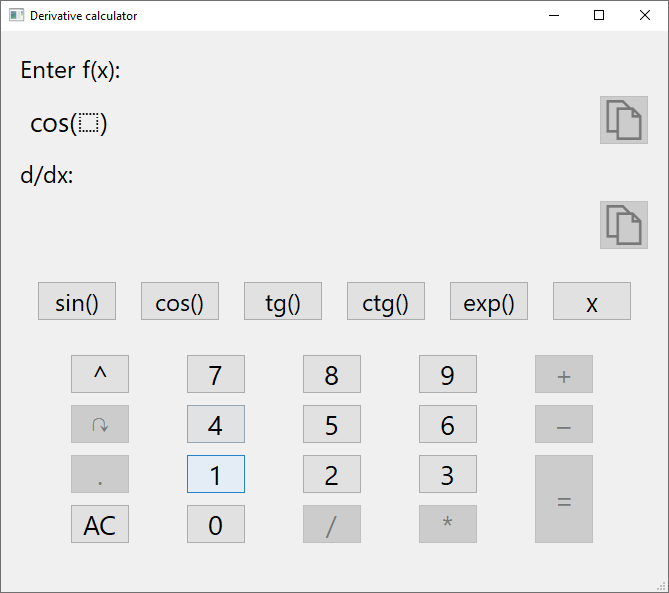
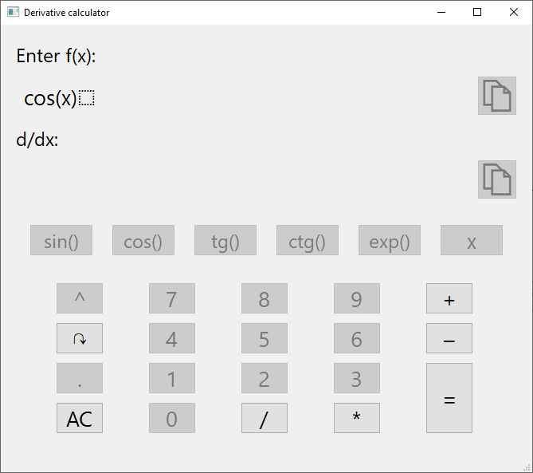
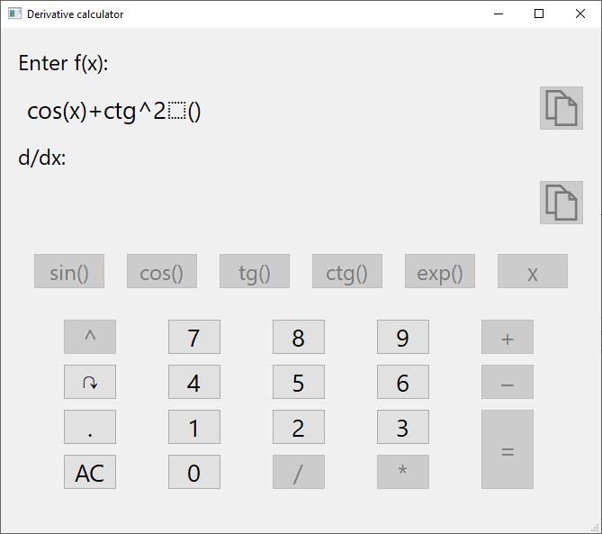

## How to use it
___

Now you can see the start of the program. For correcting input some buttons are blocked. 

The Dotted square showes where are you now. After entering a function it will be inside it automatically

If you want you can manage him by pressing the arrow button

You can also enter a power of the function. To enter it you need to press power button. Pay attention that you must be inside of this func

In order to escape from power mode you need to press arrow button 

Also you can copy entered function or derivative function by pressing copy button
